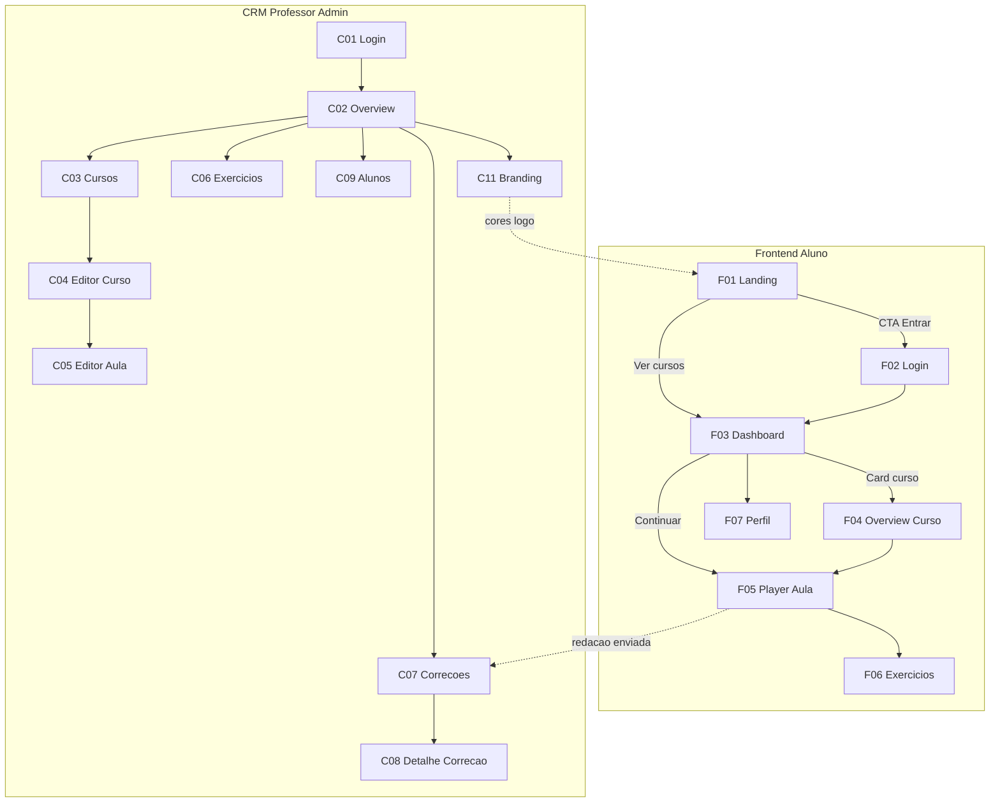
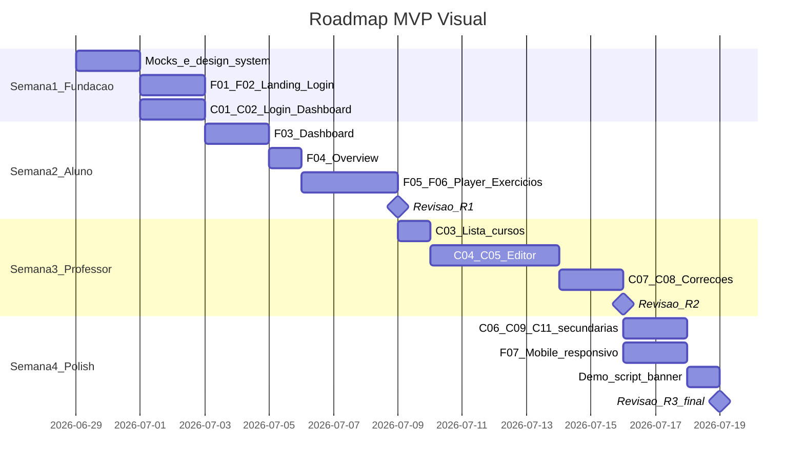
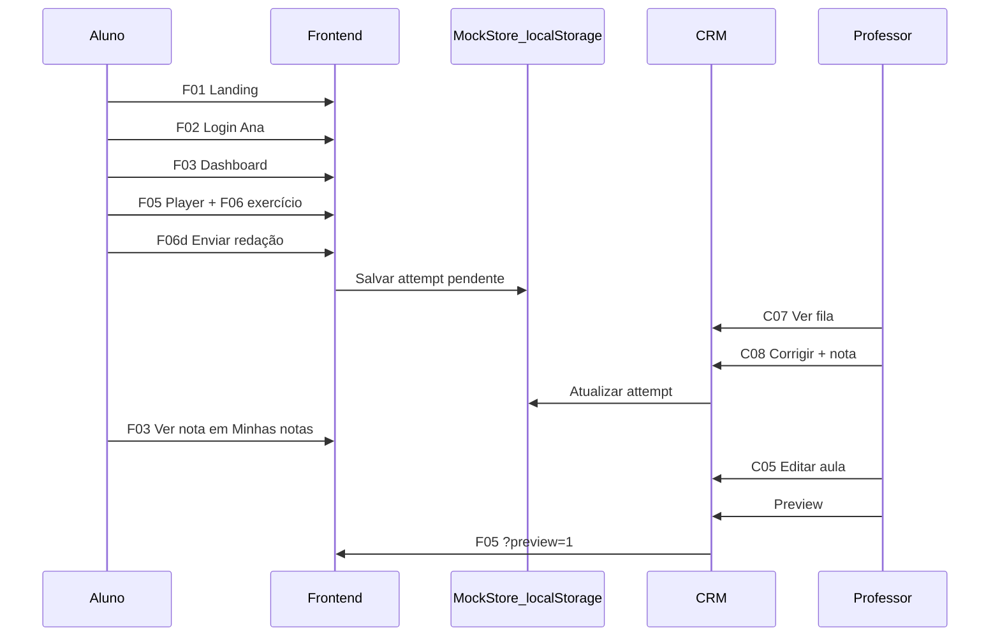

# Plano LMS — MVP Visual (Frontend + CRM com mocks)

## Objetivo desta fase

Protótipo navegável para **apresentação ao cliente e equipe de design** — validar fluxos, hierarquia visual e sensação de ambiente de ensino **sem backend**.

| Incluído                                  | Excluído                     |
| ----------------------------------------- | ---------------------------- |
| Frontend aluno + CRM professor/admin (UI) | Backend, banco, API, S3      |
| Dados mockados + interações locais        | IA, pronúncia, mobile nativo |
| White label visual                        | Auth JWT real                |

---

## Inventário de telas

### Frontend (Aluno) — 7 telas

| ID      | Rota                                     | Nome                         | Prioridade demo |
| ------- | ---------------------------------------- | ---------------------------- | --------------- |
| **F01** | `/[tenant]`                              | Landing white label          | P0              |
| **F02** | `/[tenant]/auth/login`                   | Login demo                   | P0              |
| **F03** | `/[tenant]/dashboard`                    | Dashboard aluno              | P0              |
| **F04** | `/[tenant]/cursos/[id]`                  | Overview do curso            | P1              |
| **F05** | `/[tenant]/cursos/[id]/aulas/[lessonId]` | Player de aula               | P0              |
| **F06** | (modal/inline em F05)                    | Estados de exercício         | P0              |
| **F07** | `/[tenant]/perfil`                       | Perfil e progresso por skill | P2              |

### CRM (Professor/Admin) — 11 telas

| ID      | Rota                                      | Nome                     | Persona      | Prioridade |
| ------- | ----------------------------------------- | ------------------------ | ------------ | ---------- |
| **C01** | `/login`                                  | Login demo               | Todos        | P0         |
| **C02** | `/dashboard`                              | Visão geral              | Prof + Admin | P0         |
| **C03** | `/dashboard/cursos`                       | Lista de cursos          | Prof + Admin | P0         |
| **C04** | `/dashboard/cursos/[id]`                  | Editor de curso (árvore) | Prof         | P0         |
| **C05** | `/dashboard/cursos/[id]/aulas/[lessonId]` | Editor de aula (blocos)  | Prof         | P0         |
| **C06** | `/dashboard/exercicios`                   | Banco de questões        | Prof         | P1         |
| **C07** | `/dashboard/correcoes`                    | Fila de correções        | Prof         | P0         |
| **C08** | `/dashboard/correcoes/[id]`               | Detalhe da correção      | Prof         | P0         |
| **C09** | `/dashboard/alunos`                       | Lista de alunos          | Prof + Admin | P1         |
| **C10** | `/dashboard/alunos/[id]`                  | Perfil do aluno          | Prof         | P2         |
| **C11** | `/dashboard/configuracao`                 | Branding white label     | Admin        | P1         |

**Total: 18 telas** (14 P0/P1 para demo completa)

---

## Mapa de navegação



---

# FRONTEND — Especificação detalhada por tela

## F01 — Landing white label

**Rota:** `/studio-italiano`  
**Objetivo:** Primeira impressão da escola; transmitir confiança e convidar à matrícula/login.

### Layout (desktop)

```
┌─────────────────────────────────────────────────────────────┐
│ [Logo Studio Italiano]     Cursos  Sobre  [Entrar] [Começar]│  ← Header sticky
├─────────────────────────────────────────────────────────────┤
│                                                             │
│   Aprenda italiano com methodologia                       │  ← Hero (60vh)
│   conversacional e professores nativos                      │
│   [Comece gratuitamente]  [Ver cursos]                      │
│                                    [Ilustração / foto]      │
├─────────────────────────────────────────────────────────────┤
│   Por que escolher a Studio Italiano?                       │  ← 3 cards benefícios
│   [Professores nativos] [Aulas gravadas] [Exercícios]       │
├─────────────────────────────────────────────────────────────┤
│   Cursos em destaque                                        │  ← Grid 2-3 cards
│   [Card A1] [Card A2] [Card Conversação]                    │
├─────────────────────────────────────────────────────────────┤
│   O que dizem nossos alunos                                 │  ← Depoimentos mock (2)
├─────────────────────────────────────────────────────────────┤
│   [Logo] Studio Italiano © 2026    Contato  Termos          │  ← Footer
└─────────────────────────────────────────────────────────────┘
```

### Elementos e componentes

| Zona        | Conteúdo                                  | Componente          |
| ----------- | ----------------------------------------- | ------------------- |
| Header      | Logo tenant, nav, CTAs                    | `TenantHeader`      |
| Hero        | Título, subtítulo, 2 CTAs                 | `HeroSection`       |
| Benefícios  | 3 ícones + texto curto                    | `FeatureCards`      |
| Cursos      | Thumbnail, nível badge A1/A2, título, CTA | `CoursePreviewCard` |
| Depoimentos | Avatar, nome, quote                       | `TestimonialCard`   |
| Footer      | Links, copyright                          | `TenantFooter`      |

### Estados

- **Default:** cores do tenant (`--primary`, `--accent`)
- **Hover cards:** leve elevação + borda primary
- **Mobile:** menu hamburger → Sheet com links

### Ações do usuário

| Ação                          | Destino              |
| ----------------------------- | -------------------- |
| Entrar / Comece gratuitamente | F02 Login            |
| Ver cursos (logado)           | F03 Dashboard        |
| Card curso (público)          | F02 → após login F04 |

### Copy sugerido (pt-BR)

- Hero: _"Fale italiano com confiança — do café ao aeroporto"_
- CTA primário: _"Acessar minha área"_
- CTA secundário: _"Conhecer os cursos"_

### Critérios de revisão (R1)

- [ ] Logo e cores transmitem identidade da escola?
- [ ] Hierarquia visual clara em 5 segundos?
- [ ] CTAs óbvios sem scroll excessivo?

---

## F02 — Login demo

**Rota:** `/studio-italiano/auth/login`  
**Objetivo:** Entrada rápida na demo; escolher persona de aluno.

### Layout

```
┌─────────────────────────────────────────────────────────────┐
│                    [Logo Studio Italiano]                   │
│                                                             │
│              Bem-vinda de volta!                            │
│              Acesse sua área de estudos                     │
│                                                             │
│   ┌─ Modo demonstração ─────────────────────────────────┐  │
│   │  Escolha um perfil para explorar:                    │  │
│   │                                                      │  │
│   │  [👤 Ana — iniciante, 0% progresso]                  │  │
│   │  [👤 Lucas — avançado, 90% progresso]                │  │
│   │  [👤 Maria — meio do curso, 45%]                     │  │
│   └──────────────────────────────────────────────────────┘  │
│                                                             │
│   ─── ou ───                                                │
│                                                             │
│   E-mail: [________________]                                │
│   Senha:  [________________]                              │
│   [Entrar]  ← desabilitado ou mock "use perfis acima"      │
│                                                             │
│   ← Voltar para o site                                      │
└─────────────────────────────────────────────────────────────┘
```

### Elementos

- Card central max-width 420px
- Banner amarelo suave: _"Modo demonstração — sem servidor"_
- 3 botões persona com avatar, nome, % progresso
- Form email/senha **visual only** (mostra futuro, não funcional)

### Ações

| Ação                           | Resultado                       |
| ------------------------------ | ------------------------------- |
| Clicar persona Ana/Lucas/Maria | Salva em context → redirect F03 |
| Voltar                         | F01 Landing                     |

### Critérios de revisão (R1)

- [ ] Fica claro que é demo, não produção?
- [ ] Personas comunicam estados diferentes de progresso?

---

## F03 — Dashboard aluno

**Rota:** `/studio-italiano/dashboard`  
**Objetivo:** Hub central — continuar estudo, ver cursos, acompanhar notas.

### Layout

```
┌─────────────────────────────────────────────────────────────┐
│ [Logo] Studio Italiano          Olá, Ana!  [Avatar ▼]      │  ← AppHeader
├─────────────────────────────────────────────────────────────┤
│                                                             │
│  ┌─ Continuar de onde parou ─────────────────────────────┐ │
│  │  ▶ Aula 3: Ordinare al ristorante                      │ │
│  │  Italiano A1 · Módulo "No restaurante" · 45% curso    │ │
│  │  [Continuar aula →]                                    │ │
│  └────────────────────────────────────────────────────────┘ │
│                                                             │
│  Resumo rápido                                              │
│  [📚 2 cursos]  [✓ 12 aulas]  [🔥 3 dias seguidos]         │  ← Stats row
│                                                             │
│  Meus cursos                                                │
│  ┌──────────────┐  ┌──────────────┐                        │
│  │ [thumb] A1   │  │ [thumb] A2   │                        │
│  │ Badge A1     │  │ Badge A2     │                        │
│  │ ████░░ 45%   │  │ ░░░░░░ 0%    │                        │
│  │ Última: ontem│  │ Não iniciado │                        │
│  │ [Continuar]  │  │ [Começar]    │                        │
│  └──────────────┘  └──────────────┘                        │
│                                                             │
│  Minhas notas recentes                                      │
│  ┌─────────────────────────────────────────────────────┐   │
│  │ Redação M2 · Nota 8.5 · "Bom uso do condizionale"  │   │
│  │ Quiz Aula 2 · 100% · Corrigido automaticamente      │   │
│  └─────────────────────────────────────────────────────┘   │
│                                                             │
│  Em breve (placeholder Fase 2)                              │
│  [Flashcards] [Agenda ao vivo] [Pronúncia] — badge "Em breve"│
└─────────────────────────────────────────────────────────────┘
```

### Componentes

| Componente             | Descrição                              |
| ---------------------- | -------------------------------------- |
| `ContinueLearningCard` | Destaque hero com próxima aula         |
| `StatPill`             | Ícone + número + label                 |
| `EnrolledCourseCard`   | Thumb, badge nível, progress, CTA      |
| `GradeListItem`        | Exercício, nota, feedback resumido     |
| `ComingSoonStrip`      | Placeholders Fase 2 (opcional na demo) |

### Estados

| Estado     | UI                                            |
| ---------- | --------------------------------------------- |
| Ana 0%     | Card "Continuar" aponta Aula 1                |
| Lucas 90%  | Card mostra última aula quase completa        |
| Sem cursos | Empty state ilustrado + "Fale com sua escola" |

### Ações

| Ação           | Destino                 |
| -------------- | ----------------------- |
| Continuar aula | F05 Player              |
| Card curso     | F04 Overview            |
| Avatar menu    | F07 Perfil, Sair → F02  |
| Nota recente   | F05 na aula relacionada |

### Critérios de revisão (R1)

- [ ] "Continuar" é o elemento mais visível?
- [ ] Progresso compreensível em 1 olhar?
- [ ] Tom acolhedor, não corporativo?

---

## F04 — Overview do curso

**Rota:** `/studio-italiano/cursos/[courseId]`  
**Objetivo:** Contexto antes de mergulhar nas aulas; visão do programa.

### Layout

```
┌─────────────────────────────────────────────────────────────┐
│ ← Dashboard    Italiano A1 — Primeiros passos               │
├─────────────────────────────────────────────────────────────┤
│  ┌────────────┐  Italiano A1 — Primeiros passos             │
│  │  [thumb]   │  Badge A1 · 8 aulas · ~4h                   │
│  │  grande    │  Aprenda saudações, números e situações     │
│  └────────────┘  do dia a dia em italiano.                  │
│                  ████████░░ 45% concluído                   │
│                  [Continuar · Aula 3]  [Ver todas as aulas] │
├─────────────────────────────────────────────────────────────┤
│  Conteúdo do curso                                          │
│  ▼ Módulo 1 — Ciao! Saudações          3/3 ✓               │
│      Aula 1 · Presentazioni              ✓ 12 min          │
│      Aula 2 · Come sta?                  ✓ 15 min          │
│  ▼ Módulo 2 — Al ristorante            1/3                 │
│      Aula 3 · Ordinare                   ● em andamento      │
│      Aula 4 · Al conto                   ○ bloqueada*       │
│  ▼ Módulo 3 — Numeri                   0/2                   │
├─────────────────────────────────────────────────────────────┤
│  Sobre este curso                                           │
│  Texto descritivo mock...                                   │
│  Professor: Marco Rossi                                     │
└─────────────────────────────────────────────────────────────┘
```

\*Aulas "bloqueadas" opcional no mock — pode ser tudo aberto na demo.

### Componentes

- `CourseHero` — thumb, meta, progress bar
- `ModuleAccordion` — módulos expansíveis com lista de aulas
- `LessonRow` — ícone status (✓ ● ○), duração, link

### Critérios de revisão (R1)

- [ ] Aluno entende estrutura curso → módulo → aula?
- [ ] CTAs levam naturalmente ao player?

---

## F05 — Player de aula (tela principal)

**Rota:** `/studio-italiano/cursos/[id]/aulas/[lessonId]`  
**Objetivo:** Experiência de estudo tipo Udemy/Hotmart — coração do produto.

### Layout desktop

```
┌──────────┬──────────────────────────────────────────────────┐
│ SIDEBAR  │  Breadcrumb: A1 > M2 > Aula 3                    │
│ 280px    │  Ordinare al ristorante · ~18 min                │
│          ├──────────────────────────────────────────────────┤
│ Italiano │                                                  │
│ A1       │  ┌─ Bloco 1: Vídeo ──────────────────────────┐  │
│          │  │  [════════ YouTube embed ════════]        │  │
│ M1 ✓     │  │  0:00 ───────●──────────── 8:24           │  │
│  A1 ✓    │  └───────────────────────────────────────────┘  │
│  A2 ✓    │                                                  │
│ M2       │  ┌─ Bloco 2: Texto ──────────────────────────┐  │
│  A3 ● ←  │  │  **Frases úteis no restaurante**            │  │
│  A4      │  │  Vorrei un tavolo per due, per favore.      │  │
│ M3       │  │  Il conto, per favore.                      │  │
│  A5      │  └───────────────────────────────────────────┘  │
│          │                                                  │
│ Progress │  ┌─ Bloco 3: PDF ─────────────────────────────┐  │
│ 45%      │  │  📄 Cardápio_ristorante.pdf · [Abrir]       │  │
│ ████░░   │  └───────────────────────────────────────────┘  │
│          │                                                  │
│          │  ┌─ Bloco 4: Exercício ────────────────────────┐  │
│          │  │  (ver F06)                                   │  │
│          │  └───────────────────────────────────────────┘  │
│          │                                                  │
│          │  [✓ Marcar aula como concluída]  [Aula anterior] [Próxima →] │
└──────────┴──────────────────────────────────────────────────┘
```

### Layout mobile

- Sidebar → botão "Conteúdo" abre `Sheet` lateral
- Vídeo full-width 16:9
- Blocos empilhados verticalmente
- FAB ou barra fixa inferior: Anterior | Concluir | Próxima

### Componentes

| Componente             | Função                                    |
| ---------------------- | ----------------------------------------- |
| `CourseSidebar`        | Árvore módulos/aulas + % curso            |
| `LessonHeader`         | Breadcrumb, título, duração               |
| `ContentBlockRenderer` | Switch por tipo de bloco                  |
| `VideoEmbed`           | iframe + barra progresso mock             |
| `RichTextBlock`        | Markdown/HTML didático                    |
| `PdfBlock`             | Card com ícone + botão abrir (modal mock) |
| `AudioBlock`           | Player HTML5 com waveform decorativa      |
| `LessonNavBar`         | Anterior / Concluir / Próxima             |

### Comportamentos

- Sidebar: aula atual destacada (`●`); concluídas com `✓`
- Scroll spy opcional: bloco ativo na sidebar (P2)
- Ao concluir: toast _"Aula concluída! +5% no curso"_ + sidebar atualiza
- Próxima aula: navega para próximo `lessonId`

### Critérios de revisão (R1) — **crítico**

- [ ] Sensação de "sala de aula digital"?
- [ ] Sidebar sempre acessível sem perder conteúdo?
- [ ] Fluxo vídeo → texto → exercício é natural?
- [ ] Mobile usável com uma mão?

---

## F06 — Estados de exercício (dentro de F05)

**Objetivo:** Feedback didático imediato; simular avaliação.

### F06a — Múltipla escolha

```
┌─ Exercício ─────────────────────────────────────┐
│  Escolha a tradução correta:                      │
│  "Buongiorno"                                     │
│                                                   │
│  ○ Boa noite                                      │
│  ● Bom dia          ← seleção                     │
│  ○ Até logo                                       │
│  ○ Por favor                                      │
│                                                   │
│  [Verificar resposta]                             │
└───────────────────────────────────────────────────┘
        ↓ após verificar (correto)
┌─ ✓ Correto! ────────────────────────────────────┐
│  "Buongiorno" = Bom dia (saudação matinal)        │
│  [Próximo exercício]                              │
└───────────────────────────────────────────────────┘
```

### F06b — Verdadeiro / Falso

- Dois botões grandes: `Verdadeiro` | `Falso`
- Feedback com explicação gramatical curta

### F06c — Lacunas (fill blank)

```
  Complete: Vorrei un caffè, ___________.
  [ per favore     ]  ← input inline
  [Verificar]
```

- Múltiplas lacunas = array de inputs
- Erro: highlight vermelho suave + dica

### F06d — Resposta escrita

```
  Escreva um diálogo curto pedindo a conta no restaurante.
  ┌─────────────────────────────────────────┐
  │ Il conto, per favore. Abbiamo mangiato  │
  │ molto bene, grazie!                       │
  └─────────────────────────────────────────┘
  [Enviar para correção]
        ↓
  ⏳ Aguardando correção do professor
  (Aparece em CRM C07)
```

### Componente único

`ExercisePlayer` com props `{ type, config, onComplete, onSubmitWritten }`

### Critérios de revisão (R1)

- [ ] Feedback explica, não só certo/errado?
- [ ] Estados loading/success/error distintos visualmente?

---

## F07 — Perfil e skills (P2)

**Rota:** `/studio-italiano/perfil`  
**Objetivo:** Mostrar visão futura de controle de nível por skill.

### Layout

```
  Perfil — Ana Silva
  [Avatar]  ana@email.com · Membro desde mar/2026

  Italiano — Nível A1
  Grammar    ████████░░  70%
  Listening  ████░░░░░░  45%
  Speaking   █████████░  80%
  Writing    ██████░░░░  65%

  Histórico de atividade (lista mock últimas 7 dias)
```

- Radar chart opcional (P2)
- Dados 100% mock; comunica roadmap Fase 2

---

# CRM — Especificação detalhada por tela

## C01 — Login demo

**Rota:** `/login`

```
┌─────────────────────────────────────────────────────────────┐
│                    LMS — Painel da escola                   │
│                                                             │
│   Modo demonstração                                         │
│   [👨‍🏫 Entrar como Professor — Marco Rossi]                  │
│   [⚙️ Entrar como Admin — Escola]                           │
│                                                             │
│   Banner: Dados locais · sem servidor                       │
└─────────────────────────────────────────────────────────────┘
```

- Professor → nav completa exceto C11
- Admin → nav inclui C11 Branding + usuários legado

---

## C02 — Visão geral (Dashboard)

**Rota:** `/dashboard`

### Layout professor

```
┌──────────┬──────────────────────────────────────────────────┐
│ SIDEBAR  │  Bom dia, Prof. Marco!                           │
│          │                                                  │
│ Visão    │  ┌─────────┐ ┌─────────┐ ┌─────────┐ ┌─────────┐│
│ Cursos   │  │ 2       │ │ 24      │ │ 3       │ │ 5       ││
│ Exercíc. │  │ Cursos  │ │ Alunos  │ │ Correç. │ │ Aulas   ││
│ Correç.  │  │ ativos  │ │ ativos  │ │ pendent.│ │ public. ││
│ Alunos   │  └─────────┘ └─────────┘ └─────────┘ └─────────┘│
│ Config*  │                                                  │
│          │  Ações rápidas                                   │
│          │  [+ Novo curso]  [Corrigir redações (3)]         │
│          │                                                  │
│          │  Atividade recente                               │
│          │  · Ana concluiu Aula 3 — há 2h                   │
│          │  · Lucas enviou redação — há 4h                  │
│          │                                                  │
│          │  Seus cursos                                     │
│          │  [Card A1 — 8 aulas] [Card A2 — rascunho]        │
└──────────┴──────────────────────────────────────────────────┘
```

### Sidebar nav (professor)

| Item         | Ícone           | Rota              |
| ------------ | --------------- | ----------------- |
| Visão geral  | LayoutDashboard | C02               |
| Meus cursos  | BookOpen        | C03               |
| Exercícios   | HelpCircle      | C06               |
| Correções    | ClipboardCheck  | C07 (badge count) |
| Alunos       | Users           | C09               |
| Configuração | Palette         | C11 (admin only)  |

### Critérios de revisão (R2)

- [ ] Professor vê prioridades do dia (correções)?
- [ ] Ações rápidas reduzem cliques?

---

## C03 — Lista de cursos

**Rota:** `/dashboard/cursos`

```
  Meus cursos                          [+ Criar curso]

  Filtros: [Todos ▼] [Publicado] [Rascunho]   🔍 Buscar...

  ┌─────────────────────────────────────────────────────────┐
  │ [thumb]  Italiano A1 — Primeiros passos                 │
  │          Badge A1 · Publicado · 8 aulas · 24 alunos     │
  │          [Editar] [Visualizar como aluno ↗] [···]         │
  ├─────────────────────────────────────────────────────────┤
  │ [thumb]  Italiano A2 — Conversação                      │
  │          Badge A2 · Rascunho · 3 aulas                  │
  │          [Editar] [Publicar] [···]                      │
  └─────────────────────────────────────────────────────────┘
```

### Modal criar curso (Dialog)

- Título, descrição, nível (A1–C2), categoria, thumbnail (URL mock)
- Cria curso vazio → redirect C04

### Ações

| Ação                  | Resultado                             |
| --------------------- | ------------------------------------- |
| Editar                | C04 Editor                            |
| Visualizar como aluno | Abre F04/F05 em nova aba (mesmo mock) |
| Publicar              | Toggle status local                   |

---

## C04 — Editor de curso (árvore)

**Rota:** `/dashboard/cursos/[id]`

### Layout — painel esquerdo dominante

```
┌──────────────────┬──────────────────────────────────────────┐
│ ESTRUTURA        │  Selecione uma aula ou crie conteúdo      │
│                  │                                          │
│ [Publicado ▼]    │         [Ilustração empty state]         │
│ Italiano A1      │    Escolha uma aula à esquerda           │
│                  │    ou [+ Nova aula]                      │
│ ▼ Módulo 1       │                                          │
│    Aula 1    ✓   │                                          │
│    Aula 2    ✓   │                                          │
│ ▼ Módulo 2       │                                          │
│    Aula 3    ●   │  ← seleção highlight                     │
│    Aula 4        │                                          │
│ [+ Módulo]       │                                          │
│                  │                                          │
│ ─────────────    │                                          │
│ [⚙ Config curso] │                                          │
└──────────────────┴──────────────────────────────────────────┘
```

- Clique em aula → navega para **C05** (ou split view na mesma rota)
- Drag handle nos módulos/aulas (P1; senão botões ↑↓)
- Menu `···` em aula: renomear, duplicar, excluir

### Critérios de revisão (R2)

- [ ] Árvore legível com 10+ aulas?
- [ ] Professor entende onde clicar para editar conteúdo?

---

## C05 — Editor de aula (blocos)

**Rota:** `/dashboard/cursos/[id]/aulas/[lessonId]`

### Layout — referência principal do CRM

```
┌──────────────────┬──────────────────────────────────────────┐
│ (árvore compacta)│  Aula 3: Ordinare al ristorante          │
│                  │  [Rascunho ▼]  [Pré-visualizar ↗] [Salvar]│
│                  ├──────────────────────────────────────────┤
│                  │  Adicionar bloco:                         │
│                  │  [🎬 Vídeo] [📝 Texto] [📄 PDF] [🔊 Áudio] │
│                  │  [❓ Exercício] [🔗 Link]                  │
│                  ├──────────────────────────────────────────┤
│                  │  ┌ Bloco 1 — Vídeo ─────────── [↑][↓][🗑]┐│
│                  │  │ URL: https://youtube.com/...           ││
│                  │  │ [Preview embed]                        ││
│                  │  └────────────────────────────────────────┘│
│                  │  ┌ Bloco 2 — Texto ─────────── [↑][↓][🗑]┐│
│                  │  │ [Editor textarea / markdown]           ││
│                  │  └────────────────────────────────────────┘│
│                  │  ┌ Bloco 3 — Exercício ─────── [↑][↓][🗑]┐│
│                  │  │ Vinculado: MC-001 "Tradução Buongiorno"││
│                  │  │ [Editar exercício] [Trocar]            ││
│                  │  └────────────────────────────────────────┘│
│                  │  [+ Adicionar bloco]                      │
└──────────────────┴──────────────────────────────────────────┘
```

### Dialog "Adicionar bloco"

| Tipo      | Campos no form                         |
| --------- | -------------------------------------- |
| Vídeo     | URL YouTube/Vimeo                      |
| Texto     | Textarea markdown                      |
| PDF       | Selecionar da biblioteca (mock) ou URL |
| Áudio     | URL ou biblioteca                      |
| Exercício | Picker do banco C06 ou criar inline    |
| Link      | URL + label                            |

### Ações

| Ação           | Resultado                                      |
| -------------- | ---------------------------------------------- |
| Pré-visualizar | Abre F05 com dados locais (query `?preview=1`) |
| Salvar         | Toast + persiste em MockStore                  |
| Publicar aula  | Status → published                             |

### Critérios de revisão (R2) — **crítico**

- [ ] Professor consegue montar aula sem treinamento?
- [ ] Adicionar/reordenar blocos é fluido?
- [ ] Preview reflete o que aluno verá?

---

## C06 — Banco de exercícios

**Rota:** `/dashboard/exercicios`

```
  Banco de questões                    [+ Criar] [✨ Gerar com IA — em breve]

  Filtro tipo: [Todos] [MC] [V/F] [Lacunas] [Escrita]

  ┌──────────────────────────────────────────────────────────┐
  │ MC-001 · Múltipla escolha · "Tradução Buongiorno"        │
  │ Usado em: A1 Aula 1, A1 Aula 3          [Preview] [Editar]│
  ├──────────────────────────────────────────────────────────┤
  │ WR-002 · Resposta escrita · "Diálogo no restaurante"      │
  │ Usado em: A1 Aula 3                     [Preview] [Editar]│
  └──────────────────────────────────────────────────────────┘
```

### Dialog criar/editar exercício

- Tabs por tipo; form dinâmico
- Preview lateral ao vivo (`ExercisePreview`)

---

## C07 — Fila de correções

**Rota:** `/dashboard/correcoes`

```
  Correções pendentes (3)

  [Pendentes] [Corrigidas] [Todas]

  ┌──────────────────────────────────────────────────────────┐
  │ 🔴 Lucas · A1 Aula 3 · Redação · enviado há 4h           │
  │    "Il conto, per favore..."              [Corrigir →]   │
  ├──────────────────────────────────────────────────────────┤
  │ 🔴 Ana · A1 Módulo 2 · Redação · enviado há 1d           │
  │    "Vorrei la pizza margherita..."        [Corrigir →]   │
  └──────────────────────────────────────────────────────────┘
```

- Badge count na sidebar
- Sync com F06d via localStorage compartilhado

---

## C08 — Detalhe da correção

**Rota:** `/dashboard/correcoes/[id]`

```
  ← Voltar    Correção — Lucas · A1 Aula 3

  Enunciado
  "Escreva um diálogo curto pedindo a conta no restaurante."

  Resposta do aluno
  ┌──────────────────────────────────────────────────────────┐
  │ Il conto, per favore. Abbiamo mangiato molto bene!       │
  └──────────────────────────────────────────────────────────┘

  Avaliação
  Nota: [8.5____] / 10
  Feedback para o aluno:
  ┌──────────────────────────────────────────────────────────┐
  │ Ótimo uso de "il conto". Tente incluir "grazie" no       │
  │ final para soar mais natural.                            │
  └──────────────────────────────────────────────────────────┘

  [✨ Sugerir nota com IA — em breve]    [Enviar correção]
```

- Após enviar: status → corrigida; aparece em F03 "Minhas notas"

---

## C09 — Lista de alunos

**Rota:** `/dashboard/alunos`

```
  Alunos (24)                              🔍 Buscar...

  │ Aluno      │ Cursos    │ Progresso A1 │ Última atividade │ Ações  │
  │ Ana Silva  │ A1        │ 45%          │ há 2h            │ [Ver]  │
  │ Lucas Mendes│ A1, A2   │ 90% / 0%     │ há 4h            │ [Ver]  │
  │ Maria Costa│ A1        │ 12%          │ há 3d            │ [Ver]  │
```

---

## C10 — Perfil do aluno (P2)

**Rota:** `/dashboard/alunos/[id]`

- Progresso por módulo, notas, timeline de atividade
- Link para correções desse aluno

---

## C11 — Configuração / Branding

**Rota:** `/dashboard/configuracao` (admin only)

```
  Identidade visual — Studio Italiano

  Nome da escola:    [Studio Italiano________]
  Slug:              studio-italiano (readonly mock)
  Logo:              [Upload mock] [Preview]

  Cores
  Primária:   [#2D5A3D] [picker]
  Secundária: [#F5F0E8] [picker]

  Preview ao vivo                    [Abrir landing ↗]
  ┌─────────────────────────────────┐
  │ mini mock do header F01         │
  │ com cores aplicadas             │
  └─────────────────────────────────┘

  Landing — textos (opcional P2)
  Hero título: [________________________]
  [Salvar alterações]
```

- Alterações aplicam em TenantProvider via MockStore
- Link "Abrir landing" → F01 em nova aba

---

# Roadmap de implementação e revisão

## Visão geral por semanas



---

## Sprint 1 — Fundação + primeiras telas (Dias 1–4)

| Dia | Entregável                                          | Telas                |
| --- | --------------------------------------------------- | -------------------- |
| 1   | `shared/lms-mocks/`, tipos, seed Studio Italiano    | —                    |
| 1   | shadcn components, tokens, `SCREEN_MAP.md`          | —                    |
| 2   | TenantProvider, DEMO_MODE                           | F01                  |
| 2   | Login personas                                      | F02, C01             |
| 3   | Shell aluno + professor                             | F03 (esqueleto), C02 |
| 4   | **Checkpoint interno** — navegação F01→F02→F03 abre | —                    |

---

## Sprint 2 — Experiência aluno (Dias 5–9)

| Dia | Entregável                        | Telas        |
| --- | --------------------------------- | ------------ |
| 5   | Continue card, course grid, stats | F03 completo |
| 6   | Module accordion, course hero     | F04          |
| 7–8 | Sidebar, blocos, video/text/pdf   | F05          |
| 9   | ExercisePlayer 4 tipos            | F06          |
| 9   | **Revisão R1** com design/cliente | F01–F06      |

---

## Sprint 3 — Experiência professor (Dias 10–15)

| Dia   | Entregável                                  | Telas    |
| ----- | ------------------------------------------- | -------- |
| 10    | Lista + criar curso                         | C03      |
| 11–13 | Árvore + editor blocos + preview            | C04, C05 |
| 14    | Fila + detalhe correção + sync localStorage | C07, C08 |
| 15    | **Revisão R2** com design/cliente           | C02–C08  |

---

## Sprint 4 — Complementos + demo (Dias 16–18)

| Dia | Entregável                                   | Telas         |
| --- | -------------------------------------------- | ------------- |
| 16  | Banco exercícios, alunos, branding           | C06, C09, C11 |
| 17  | Mobile Sheet sidebar, touch targets          | F05 mobile    |
| 18  | `DEMO_SCRIPT.md`, banner, polish             | —             |
| 18  | **Revisão R3 final** — go/no-go apresentação | Todas P0      |

---

## Sessões de revisão (R1, R2, R3)

### R1 — Fluxo aluno (fim Semana 2)

**Participantes:** Product, Design, Cliente (opcional)  
**Duração:** 45–60 min  
**Roteiro demo:**

1. F01 Landing — white label
2. F02 Login como Ana
3. F03 Dashboard — "Continuar"
4. F05 Player — vídeo + texto + exercício MC
5. F06 — enviar redação
6. F05 — marcar aula concluída, ver progresso

**Perguntas guia:**

- A navegação é intuitiva para um aluno 40+ anos?
- O player parece um produto comercial (Udemy/Hotmart)?
- O feedback dos exercícios é didático o suficiente?
- Algo essencial falta antes de investir no professor?

**Output:** Lista de ajustes P0/P1/P2 → issue ou doc `REVIEW_R1.md`

---

### R2 — Fluxo professor (fim Semana 3)

**Roteiro demo:**

1. C01 Login professor
2. C02 Dashboard — correções pendentes
3. C03 Lista cursos
4. C05 Editor — adicionar bloco texto + exercício
5. C05 Preview → F05 nova aba
6. C08 Corrigir redação da Ana
7. Voltar F03 Ana — ver nota

**Perguntas guia:**

- Professor cria aula sem suporte técnico?
- Editor é rápido ou burocrático?
- Fluxo correção é claro?
- Falta biblioteca de mídia visível?

**Output:** `REVIEW_R2.md`

---

### R3 — Demo final (fim Semana 4)

**Checklist go/no-go:**

| #   | Critério                            | OK? |
| --- | ----------------------------------- | --- |
| 1   | 14 telas P0/P1 navegáveis sem erro  |     |
| 2   | Mobile iPhone/Android usável        |     |
| 3   | White label evidente (F01 + C11)    |     |
| 4   | Loop aluno→professor→aluno funciona |     |
| 5   | Copy pt-BR revisado                 |     |
| 6   | Banner demo visível                 |     |
| 7   | Cliente aprova apresentação externa |     |

**Output:** Aprovação para Fase técnica (backend) ou lista de refinamentos visuais

---

## Matriz de prioridade para análise

Use esta matriz nas revisões para decidir melhorias:

| Tela              | Impacto UX | Esforço | Prioridade ajuste         |
| ----------------- | ---------- | ------- | ------------------------- |
| F05 Player        | Alto       | Alto    | P0 — iterar até aprovar   |
| F03 Dashboard     | Alto       | Médio   | P0                        |
| C05 Editor aula   | Alto       | Alto    | P0                        |
| F01 Landing       | Médio      | Médio   | P1                        |
| C08 Correção      | Médio      | Baixo   | P1                        |
| F07 Perfil skills | Baixo      | Médio   | P2 — pode ser placeholder |
| C10 Perfil aluno  | Baixo      | Médio   | P2                        |

---

## Fluxo end-to-end para validação



---

## Artefatos de documentação a criar

| Arquivo                           | Conteúdo                                             |
| --------------------------------- | ---------------------------------------------------- |
| `shared/lms-mocks/DEMO_SCRIPT.md` | Roteiro minuto-a-minuto para apresentação            |
| `docs/SCREEN_MAP.md`              | Inventário F01–F07, C01–C11 com status implementação |
| `docs/REVIEW_R1.md`               | Feedback pós-revisão aluno                           |
| `docs/REVIEW_R2.md`               | Feedback pós-revisão professor                       |
| `docs/UX_CHECKLIST.md`            | Checklist acessibilidade, mobile, copy               |

---

## Arquitetura técnica (resumo)

- `shared/lms-mocks/` — seed único Studio Italiano
- `NEXT_PUBLIC_DEMO_MODE=true` — zero API
- MockStore Context + localStorage para progresso e correções
- Componentes isolados em `components/lms/` (ambos apps)

---

## Fase técnica posterior

Após R3 aprovado: backend multi-tenant, substituir MockStore por API, auth real, S3, IA (Fase 2).

Tipos em `shared/lms-mocks/types.ts` antecipam contrato da API futura.

---

## Riscos

| Risco                             | Mitigação                                   |
| --------------------------------- | ------------------------------------------- |
| Escopo de 18 telas estoura prazo  | P2 explícito; F07/C10 podem ser placeholder |
| Revisão R1 atrasada               | Entregar F05 mínimo antes de F04            |
| Editor complexo demais            | MVP C05 só 4 tipos de bloco                 |
| Design quer mudança grande pós-R1 | Componentes `lms/` isolados para restyle    |
