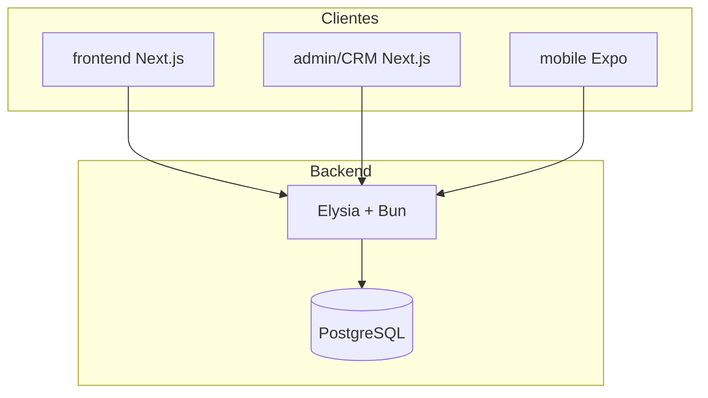

# COMMON_ARCHITECTURE

Padrões arquiteturais e estrutura de pastas consolidados.

---

## Diagrama do ecossistema (padrão observado)



**Evidência:** `ARCHITECTURE.md` em ambas documentações.

---

## Backend — estrutura canônica

```
backend/
├── src/
│   ├── index.ts              # Bootstrap: CORS, JWT, montagem de rotas
│   ├── config/               # Validação de env (melhoria template)
│   ├── jwt/                  # Plugin JWT Elysia
│   ├── lib/                  # Logger, errors, result helpers
│   ├── drizzle/
│   │   ├── db.ts             # Conexão postgres + drizzle
│   │   ├── schema.ts         # Schema único
│   │   └── migrate.ts        # Script de migração
│   └── resource/             # Módulos de domínio
│       └── <feature>/
│           ├── route.ts      # HTTP, guards, auth
│           └── handle.ts     # Lógica + queries
├── drizzle/                  # SQL migrations
├── drizzle.config.ts
├── Dockerfile
└── package.json
```

**Divergências observadas:**
- Balaio: `handler.ts` em auth (typo); Parlare: `handler.ts` padrão em todos.
- Parlare: rotas admin centralizadas em `resource/admin/route.ts`.
- Balaio: dual auth (`/auth` admin + `/user` mobile).

**Decisão template:** Um sistema de auth unificado com RBAC (`role: user | admin`), rotas `/auth/*` e `/admin/*`.

---

## Frontend web — estrutura canônica

```
frontend/
├── app/
│   ├── layout.tsx            # Providers raiz
│   ├── page.tsx              # Redirect
│   ├── (public)/             # Rotas públicas
│   │   ├── layout.tsx
│   │   └── auth/login/
│   └── (app)/                # Rotas autenticadas
│       ├── layout.tsx        # AuthenticatedShell
│       └── dashboard/
├── components/
│   ├── layout/               # Shells
│   └── ui/                   # shadcn
├── lib/
│   ├── api.ts                # ApiClient único
│   ├── context/              # AppContext, UiLocale
│   ├── i18n/                 # Sistema custom (Parlare)
│   └── utils.ts
├── hooks/
└── public/
```

**Evidência:** `frontend-parlare/app/`, `language-parlare/docs/UI_PATTERNS.md`

**Proteção de rotas:** Client-side via shell (`AuthenticatedShell`), não middleware Next.js (Parlare).

---

## Admin/CRM — estrutura canônica

```
crm/
├── app/
│   ├── layout.tsx
│   ├── page.tsx              # Redirect login/dashboard
│   ├── login/page.tsx
│   └── dashboard/
│       ├── layout.tsx        # Sidebar + auth guard
│       ├── page.tsx          # Overview
│       ├── usuarios/page.tsx
│       └── perfil/page.tsx
├── components/ui/
├── lib/
│   ├── api.ts
│   └── types.ts
└── hooks/
```

**Evidência:** `admin-parlare/app/dashboard/`, `RDA.md`

---

## Mobile — estrutura canônica

```
mobile/
├── app/
│   ├── _layout.tsx           # Providers raiz (Query, Auth, NativeWind)
│   ├── index.tsx             # Entry/redirect
│   ├── auth/                 # Stack de auth
│   └── dashboard/            # Tabs/área autenticada
├── components/               # UI compartilhada (ex.: Screen)
├── config/
│   └── api.ts                # Base URL (EXPO_PUBLIC_API_URL)
├── context/                  # AuthProvider
├── hooks/                    # useQuery/useMutation + fetch
├── lib/
│   └── reactQueryClient.ts
├── global.css                # Tailwind (NativeWind v4)
├── tailwind.config.js
├── metro.config.js           # withNativeWind
└── assets/
```

**Evidência:** `mobile-template/` (gerado com `rn-new --expo-router --nativewind --bun`); padrões hooks/auth de `mobile-balaioCriativo/`

**Padrão API mobile:** Hooks por feature, sem pasta `services/` centralizada.

---

## Camadas e responsabilidades

| Camada | Responsabilidade | Onde |
|--------|------------------|------|
| route.ts | HTTP, validação Elysia, JWT | Backend |
| handle.ts | Queries Drizzle, retorno `{data,error}` | Backend |
| lib/api.ts | Todas as chamadas HTTP | Web/CRM |
| hooks/*.ts | fetch + React Query | Mobile |
| Context | Auth, tema, locale | Todos clientes |
| Shell/Layout | Guard de rotas, chrome UI | Web/CRM |

---

## Fluxo de dados

```
Cliente → lib/api.ts (ou hook) → fetch + Bearer JWT
       → Backend route.ts → handle.ts → Drizzle → PostgreSQL
       ← JSON response ←
```

Cookies httpOnly usados em Parlare backend; localStorage `authToken` nos clientes web Parlare. Template web usa localStorage (padrão Parlare frontend/admin).
